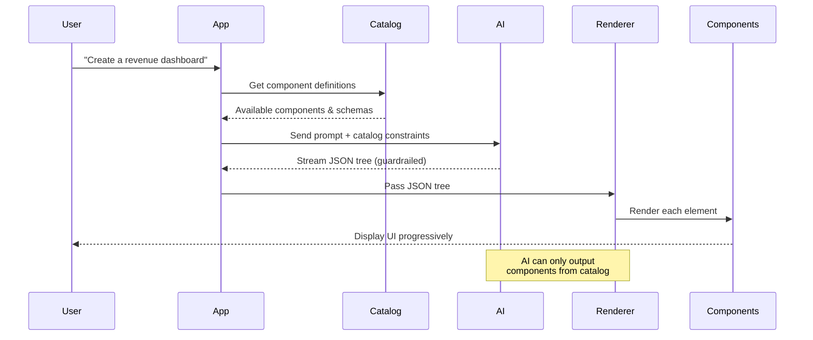

# Project Architecture Diagram

This diagram shows the high-level architecture of the **json-render** project - a system that lets AI safely generate UIs using a guardrailed catalog of components.

```mermaid
graph TB
    subgraph "json-render Monorepo"
        subgraph "Applications"
            web[Web App<br/>Docs & Playground<br/>Next.js]
            dashboard[Dashboard Example<br/>Demo App<br/>Next.js]
        end

        subgraph "Core Packages"
            core[core<br/>@json-render/core<br/>Types, Schemas, Validation]
            react[react<br/>@json-render/react<br/>React Renderer & Hooks]
        end

        subgraph "Shared Utilities"
            ui[UI Components<br/>@repo/ui<br/>Shared UI Library]
            config[ESLint Config<br/>@repo/eslint-config<br/>Shared Linting]
            tsconfig[TypeScript Config<br/>@repo/typescript-config<br/>Shared TS Settings]
        end

        subgraph "External"
            ai[AI/LLM<br/>Claude, GPT, etc.]
            zod[Zod<br/>Schema Validation]
        end
    end

    web --> react
    web --> ui
    dashboard --> react
    dashboard --> ui

    react --> core

    core --> zod

    web --> config
    dashboard --> config
    core --> config
    react --> config

    web --> tsconfig
    dashboard --> tsconfig
    core --> tsconfig
    react --> tsconfig

    ai -.->|Generates JSON| web
    ai -.->|Generates JSON| dashboard

    style web fill:#0070f3,color:#fff
    style dashboard fill:#4285f4,color:#fff
    style core fill:#ffd93d,color:#000
    style react fill:#00c7b7,color:#fff
    style ui fill:#95e1d3,color:#000
    style config fill:#e5e5e5,color:#000
    style tsconfig fill:#e5e5e5,color:#000
    style ai fill:#8b5cf6,color:#fff
    style zod fill:#3b82f6,color:#fff
```

## Project Structure Overview

### What is this project?

**json-render** is a framework that lets end users generate dashboards, widgets, apps, and data visualizations from prompts — safely constrained to components you define. It's **guardrailed**, **predictable**, and **fast**.

### Why json-render?

When users prompt for UI, you need guarantees. json-render gives AI a **constrained vocabulary** so output is always predictable:

- **Guardrailed** — AI can only use components in your catalog
- **Predictable** — JSON output matches your schema, every time
- **Fast** — Stream and render progressively as the model responds

### Main Components:

1. **@json-render/core** - Core types, schemas, catalog definitions, visibility logic, actions, and validation
2. **@json-render/react** - React renderer, providers (DataProvider, ActionProvider), hooks (useUIStream), and component system
3. **Web App** - Documentation site and playground for testing json-render
4. **Dashboard Example** - Example implementation showing how to build an AI-generated dashboard
5. **Shared Utilities** - UI components, ESLint config, and TypeScript config

### How it works:

1. **Define the guardrails** — Create a catalog of components, actions, and data bindings AI can use
2. **Users prompt** — End users describe what they want in natural language
3. **AI generates JSON** — Output is always predictable, constrained to your catalog
4. **Render fast** — Stream and render progressively as the model responds

### Technology Stack:

- **Framework**: Turborepo (for managing the monorepo)
- **Frontend**: React, Next.js
- **Language**: TypeScript
- **Schema Validation**: Zod
- **Deployment**: Vercel
- **AI Models**: Works with any LLM (Claude, GPT, etc.)

## How It Works: User Flow



## Package Dependencies

```mermaid
graph TB
    A[apps/web] --> B[@json-render/react]
    A --> C[@repo/ui]
    A --> D[@repo/eslint-config]
    A --> E[@repo/typescript-config]

    F[examples/dashboard] --> B
    F --> C
    F --> D
    F --> E

    B --> G[@json-render/core]
    B --> E

    G --> H[Zod]
    G --> D
    G --> E

    style A fill:#0070f3,color:#fff
    style F fill:#4285f4,color:#fff
    style B fill:#00c7b7,color:#fff
    style G fill:#ffd93d,color:#000
    style C fill:#95e1d3,color:#000
    style D fill:#e5e5e5,color:#000
    style E fill:#e5e5e5,color:#000
    style H fill:#3b82f6,color:#fff
```

## Core Concepts

### 1. Catalog (Guardrails)

Define what AI can use:

```typescript
const catalog = createCatalog({
  components: {
    Card: {
      props: z.object({ title: z.string() }),
      hasChildren: true,
    },
    Metric: {
      props: z.object({
        label: z.string(),
        valuePath: z.string(),
        format: z.enum(['currency', 'percent', 'number']),
      }),
    },
  },
  actions: {
    export_report: { description: 'Export dashboard to PDF' },
    refresh_data: { description: 'Refresh all metrics' },
  },
});
```

### 2. Component Registry

How components render:

```tsx
const registry = {
  Card: ({ element, children }) => (
    <div className="card">
      <h3>{element.props.title}</h3>
      {children}
    </div>
  ),
  Metric: ({ element }) => {
    const value = useDataValue(element.props.valuePath);
    return <div className="metric">{format(value)}</div>;
  },
};
```

### 3. Rendering

```tsx
import { Renderer, useUIStream } from '@json-render/react';

function Dashboard() {
  const { tree, send } = useUIStream({ api: '/api/generate' });

  return (
    <DataProvider initialData={{ revenue: 125000 }}>
      <Renderer tree={tree} components={registry} />
    </DataProvider>
  );
}
```

## Key Features

### Conditional Visibility

Show/hide components based on data or auth:

```json
{
  "type": "AdminPanel",
  "visible": { "auth": "signedIn" }
}
```

### Rich Actions

Actions with confirmation and callbacks:

```json
{
  "type": "Button",
  "props": {
    "label": "Refund Payment",
    "action": {
      "name": "refund",
      "confirm": {
        "title": "Confirm Refund",
        "variant": "danger"
      }
    }
  }
}
```

### Built-in Validation

```json
{
  "type": "TextField",
  "props": {
    "valuePath": "/form/email",
    "checks": [
      { "fn": "required" },
      { "fn": "email" }
    ]
  }
}
```
