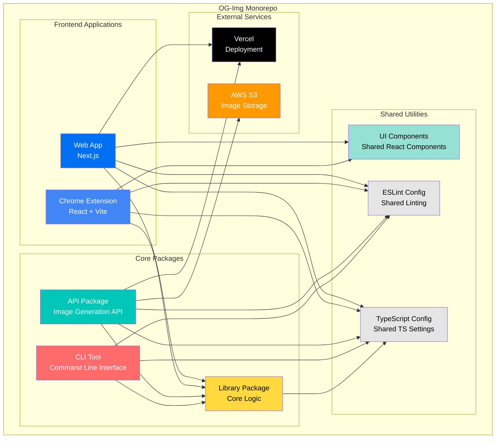
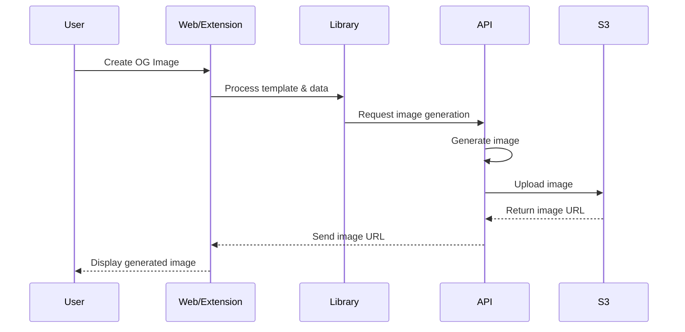
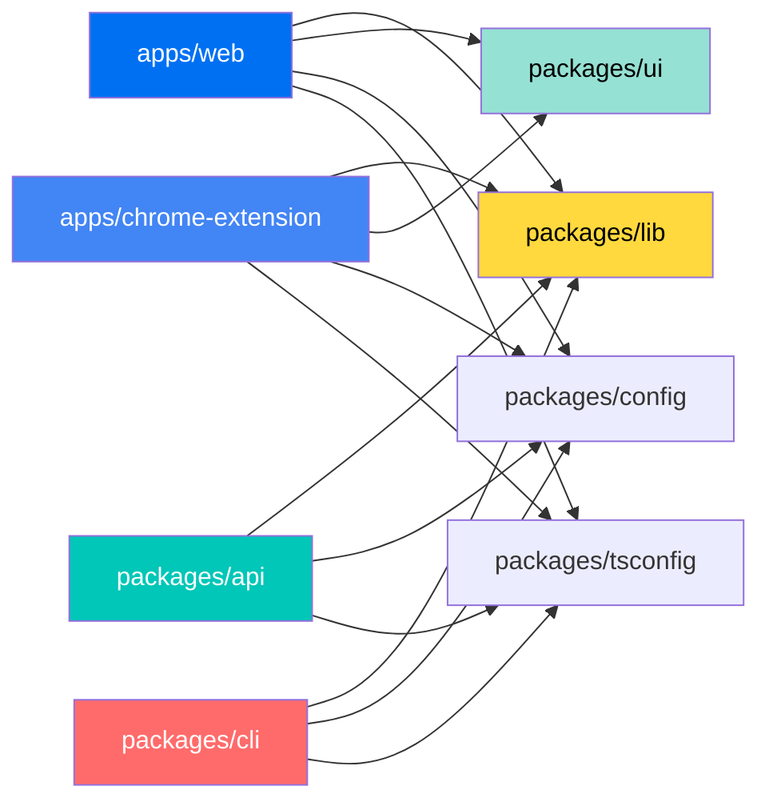

# Project Architecture Diagram

This diagram shows the high-level architecture of the OG-Img project - a monorepo for generating dynamic Open Graph images.



## Project Structure Overview

### What is this project?
This is a **monorepo** (multiple related projects in one repository) called **OG-Img** that helps you generate beautiful Open Graph (OG) images for websites and social media.

### Main Components:

1. **Web App** - A Next.js website where users can create and customize OG images
2. **Chrome Extension** - A browser extension for quick OG image generation
3. **API** - Backend service that generates the actual images
4. **CLI** - Command-line tool for developers to generate images from terminal
5. **Library (lib)** - Core shared code used by all other packages
6. **UI Components** - Reusable React components
7. **Config Packages** - Shared settings for code quality and TypeScript

### How it works:
- The Web App and Chrome Extension provide user interfaces
- They both use the Library package for core functionality
- The API generates images and stores them on AWS S3
- Everything is deployed to Vercel
- The CLI lets developers automate image generation

### Technology Stack:
- **Framework**: Turborepo (for managing the monorepo)
- **Frontend**: React, Next.js
- **Language**: TypeScript
- **Styling**: Tailwind CSS
- **Deployment**: Vercel
- **Storage**: AWS S3
```

## Simplified Component Interaction



## Package Dependencies


